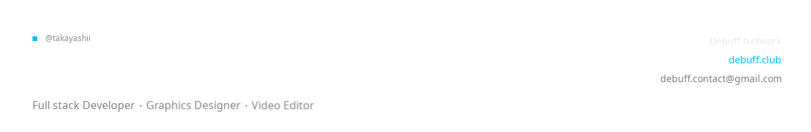
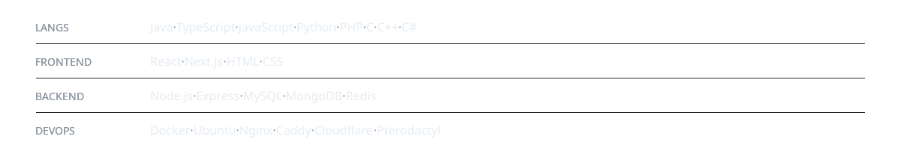
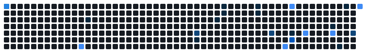

<picture>
  <source media="(prefers-color-scheme: dark)" srcset="assets/header-dark.svg" />
  <source media="(prefers-color-scheme: light)" srcset="assets/header-light.svg" />
  
</picture>

<a href="https://debuff.club">Website</a> ·
<a href="https://dc.debuff.club">Discord</a> ·
<a href="https://guns.lol/Takayashii">Bio Page</a> 

---

### Who am I?

My name is Szymon & Java is my primary language. On the Minecraft side, I build everything
from a single plugin to the entire server network. 
I also create things outside of Minecraft like simple applications, scripts and other things. Feel free to contact me!

I am currently working on Debuff Network.

<picture>
  <source media="(prefers-color-scheme: dark)" srcset="assets/stack-dark.svg" />
  <source media="(prefers-color-scheme: light)" srcset="assets/stack-light.svg" />
  
</picture>

---

### Featured Projects

<a href="https://dc.debuff.club">Debuff Network</a>  
<a href="https://guns.lol/Takayashii">Cleanify Theme</a> 

<picture>
  <source media="(prefers-color-scheme: dark)" srcset="assets/snake-dark.svg" />
  <source media="(prefers-color-scheme: light)" srcset="assets/snake-light.svg" />
  
</picture>
